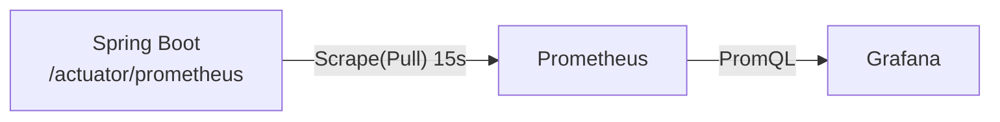
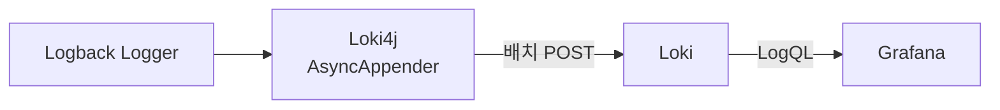
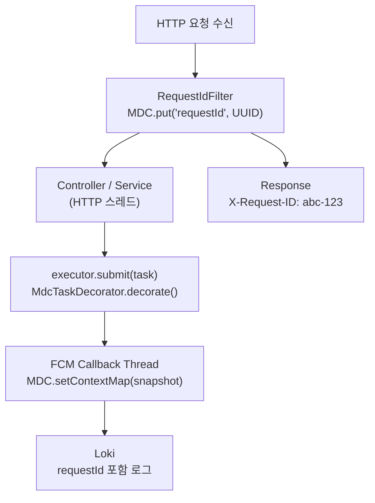

# AjouEvent 모니터링 설계 문서

> 구성 이유 · 대안 검토 · 설계 방법론 · 메트릭 의미 · 기대 효과

---

## 목차

1. [배경 및 목표](#1-배경-및-목표)
2. [처음 보는 사람을 위한 핵심 개념](#2-처음-보는-사람을-위한-핵심-개념)
3. [기술 스택 선택 이유](#3-기술-스택-선택-이유)
4. [제외한 기술과 이유](#4-제외한-기술과-이유)
5. [MDC 비동기 컨텍스트 전파 설계](#5-mdc-비동기-컨텍스트-전파-설계)
6. [주요 메트릭 목록 및 의미](#6-주요-메트릭-목록-및-의미)
7. [Grafana 대시보드 구성 방법](#7-grafana-대시보드-구성-방법)
8. [기대 효과](#8-기대-효과)

---

## 1. 배경 및 목표

AjouEvent는 아주대학교 공지사항 구독·알림을 처리하는 단일 Spring Boot 서비스입니다.
다음 세 가지 관측 가능성(Observability) 요구사항을 충족해야 했습니다.

| 관측 유형 | 질문 | 해결 도구 |
|-----------|------|-----------|
| **메트릭** | 지금 시스템이 얼마나 바쁜가? | Prometheus + Grafana |
| **로그** | 무슨 일이 일어났는가? | Loki + Loki4j |
| **추적** | 어떤 요청이 어느 스레드에서 처리됐는가? | requestId + MDC |

---

## 2. 처음 보는 사람을 위한 핵심 개념

모니터링 시스템은 “서버가 살아 있는가?”만 확인하는 도구가 아닙니다.
실제 운영에서는 다음 질문에 빠르게 답해야 합니다.

- 사용자가 느끼는 API 응답이 느려졌는가?
- 느려졌다면 애플리케이션 코드, DB 커넥션, JVM 메모리, 외부 FCM 호출 중 어디가 원인인가?
- 에러가 발생했다면 어떤 요청에서 시작됐고, 비동기 작업까지 같은 흐름으로 이어지는가?
- 컨테이너가 CPU, 메모리, 네트워크를 얼마나 쓰고 있으며 한계에 가까워지고 있는가?

이를 위해 AjouEvent는 메트릭, 로그, 요청 상관관계(requestId)를 함께 수집합니다.

### 2-1. 메트릭이란?

메트릭은 시간에 따라 변하는 숫자 데이터입니다.
예를 들어 “현재 Heap 메모리 사용량”, “1분당 HTTP 요청 수”, “FCM 전송 실패 횟수”처럼 그래프나 알림으로 표현하기 좋은 값입니다.

메트릭은 다음 상황에 강합니다.

- 장애가 발생하기 전에 증가 추세를 감지
- 특정 시간대의 성능 저하를 숫자로 비교
- 임계값 기반 알림 설정
- 서비스 개선 전후의 성능 변화 확인

AjouEvent에서는 Spring Boot Actuator와 Micrometer가 애플리케이션 내부 메트릭을 만들고, cAdvisor가 Docker 컨테이너 메트릭을 만듭니다.
Prometheus는 이 메트릭들을 주기적으로 가져와 저장합니다.

### 2-2. 로그란?

로그는 애플리케이션이 실행 중 남기는 사건 기록입니다.
예를 들어 “FCM 전송 실패”, “공지사항 크롤링 시작”, “DB 조회 실패” 같은 문장이 로그입니다.

로그는 다음 상황에 강합니다.

- 어떤 예외가 실제로 발생했는지 확인
- 특정 요청의 처리 흐름을 시간순으로 추적
- 메트릭 그래프에서 튄 지점의 원문 근거 확인
- 운영 중 발생한 예외 스택트레이스 분석

AjouEvent에서는 Logback이 로그를 만들고, Loki4j가 로그를 Loki로 전송합니다.
Grafana는 Loki에 LogQL 쿼리를 보내 로그를 조회합니다.

### 2-3. 추적이란?

추적은 여러 로그와 작업을 하나의 요청 흐름으로 묶는 일입니다.
AjouEvent는 복잡한 분산 트레이싱 시스템 대신 `requestId`를 사용합니다.

예를 들어 사용자가 API를 호출하면 다음 흐름이 생깁니다.

```
HTTP 요청 수신
→ Controller 처리
→ Service 처리
→ FCM 비동기 전송 요청
→ FCM 콜백 처리
→ 응답 또는 에러 로그 기록
```

이 과정에서 스레드가 바뀌어도 같은 `requestId`가 로그에 남으면 Loki에서 한 번에 검색할 수 있습니다.

### 2-4. Pull 방식과 Push 방식

AjouEvent 모니터링에는 두 가지 데이터 수집 방식이 함께 사용됩니다.

| 방식 | 의미 | 사용 위치 | 장점 |
|------|------|-----------|------|
| Pull | 수집기가 대상 서버로 찾아가 데이터를 가져옴 | Prometheus → App/cAdvisor | 대상이 죽으면 수집 실패가 곧 장애 신호가 됨 |
| Push | 애플리케이션이 수집 서버로 데이터를 보냄 | App → Loki | 로그처럼 이벤트가 생기는 즉시 보내기 쉬움 |

Prometheus는 15초마다 앱과 cAdvisor를 방문해 메트릭을 가져갑니다.
Loki는 애플리케이션이 Loki4j를 통해 로그를 밀어 넣는 구조입니다.

---

## 3. 기술 스택 선택 이유

### 3-1. Spring Boot Actuator

Spring Boot Actuator는 운영에 필요한 내부 상태를 HTTP 엔드포인트로 노출하는 Spring Boot 공식 모듈입니다.
일반 API가 사용자 기능을 제공한다면, Actuator는 운영자가 애플리케이션 상태를 확인할 수 있게 해주는 관리용 API입니다.

AjouEvent에서는 다음 역할을 합니다.

- `/actuator/health`: 애플리케이션이 정상 기동 중인지 확인
- `/actuator/prometheus`: Prometheus가 읽을 수 있는 텍스트 형식으로 메트릭 노출
- JVM, HTTP 요청, HikariCP, Logback 같은 기본 지표를 자동 제공
- 애플리케이션 포트 `8080`과 관리 포트 `9090`을 분리해 사용자 트래픽과 모니터링 트래픽을 구분

Actuator가 없다면 각 지표를 직접 계산하고 HTTP로 노출해야 합니다.
Actuator를 사용하면 Spring Boot 생태계에서 이미 검증된 방식으로 운영 지표를 노출할 수 있습니다.

### 3-2. Micrometer

Micrometer는 Java 애플리케이션에서 메트릭을 만들고 여러 모니터링 시스템으로 내보내는 계측 라이브러리입니다.
Spring Boot Actuator의 메트릭 기능은 내부적으로 Micrometer를 사용합니다.

쉽게 말하면 Micrometer는 애플리케이션 코드와 Prometheus 사이의 번역기입니다.
개발자는 `Counter`, `Timer`, `Gauge` 같은 추상 타입으로 지표를 만들고, Micrometer는 이를 Prometheus 형식에 맞게 변환합니다.

AjouEvent에서는 다음 지표를 Micrometer로 다룹니다.

- JVM 메모리, GC, 스레드 상태
- HTTP 요청 수와 응답 시간
- HikariCP DB 커넥션 풀 상태
- Logback 로그 레벨별 발생 횟수
- FCM 전송 성공/실패 횟수와 전송 소요 시간
- Executor 스레드풀 활성 스레드, 큐 대기 작업 수, 완료 작업 수

커스텀 지표가 필요한 경우에도 Micrometer를 사용하면 기존 Prometheus/Grafana 흐름에 자연스럽게 합쳐집니다.
예를 들어 `notification_send_total{result="failure"}`는 AjouEvent 비즈니스 도메인에 맞춘 커스텀 메트릭입니다.

### 3-3. Prometheus



Prometheus는 시계열 메트릭 데이터베이스입니다.
시계열이란 “시간 + 값 + 레이블”로 저장되는 데이터입니다.
예를 들어 다음과 같은 값이 계속 쌓입니다.

```text
http_server_requests_seconds_count{method="GET", uri="/api/notices", status="200"} 1532
jvm_memory_used_bytes{area="heap"} 268435456
notification_send_total{result="failure"} 7
```

Prometheus는 이 값을 저장하고, PromQL이라는 쿼리 언어로 집계합니다.
Grafana는 Prometheus에 PromQL을 보내 그래프를 그립니다.

**선택 이유:**

- Spring Boot Actuator + Micrometer가 Prometheus 포맷을 **네이티브 지원**하므로 별도 SDK 없이 의존성 추가만으로 연동 완료
- **Pull 방식**이므로 앱이 다운되면 `up == 0` 메트릭으로 즉시 장애 감지 가능
- Grafana와의 통합이 가장 성숙한 조합 (`datasource: prometheus` 네이티브)
- PromQL의 `rate()`, `histogram_quantile()`, `sum by()`로 복잡한 집계를 쿼리 한 줄로 처리

**설정 포인트:**

- 관리 포트 9090을 앱 포트 8080과 분리 → 모니터링 트래픽과 사용자 트래픽 격리
- `percentiles-histogram: true`로 히스토그램 버킷 활성화 → P95·P99 정확도 향상
- 보존 기간 15일: 단기 이슈 분석과 주간 트렌드 파악에 충분
- 앱 메트릭과 컨테이너 메트릭을 같은 Prometheus에 저장 → Grafana에서 애플리케이션 병목과 인프라 병목을 함께 비교 가능

---

### 3-4. Logback

Logback은 Spring Boot에서 기본으로 사용하는 Java 로깅 프레임워크입니다.
`log.info()`, `log.warn()`, `log.error()` 같은 코드가 실제 콘솔 출력, 파일 출력, 외부 시스템 전송으로 이어지게 만드는 역할을 합니다.

AjouEvent에서는 Logback이 다음 정보를 로그 한 줄에 함께 담도록 구성됩니다.

- 시간
- 로그 레벨
- 스레드명
- 로거명
- 메시지
- `requestId`
- 예외 스택트레이스

로그 포맷은 운영자가 Loki에서 검색하기 쉽도록 구조화된 형태를 사용합니다.
구조화 로그는 사람이 읽을 수 있으면서도 시스템이 파싱하기 쉬운 형태입니다.

### 3-5. Loki + Loki4j



Loki는 로그 저장소입니다.
Prometheus가 메트릭을 저장한다면, Loki는 로그를 저장합니다.
Grafana Labs에서 만든 도구라 Grafana와의 연결이 자연스럽고, Prometheus와 비슷한 레이블 모델을 사용합니다.

Loki4j는 Java Logback 로그를 Loki로 보내는 Appender입니다.
Appender란 Logback에서 “로그를 어디로 보낼지” 결정하는 출력 대상입니다.
콘솔 Appender는 터미널에 로그를 출력하고, Loki4j Appender는 Loki HTTP API로 로그를 전송합니다.

**선택 이유:**

| 기준 | Loki | ELK (Elasticsearch) |
|------|------|---------------------|
| 인덱싱 방식 | 레이블만 인덱싱 (내용 미인덱싱) | 전체 풀텍스트 인덱싱 |
| 스토리지 비용 | 낮음 | 높음 (보통 3~5배) |
| 메모리 요구 | 낮음 (~256MB) | 높음 (≥2GB 권장) |
| Prometheus 레이블 모델 | 동일 (친화적) | 별도 스키마 |
| Grafana 통합 | 네이티브 | 플러그인 필요 |

- Loki의 레이블 모델은 Prometheus와 동일 → `application`, `level` 태그로 일관된 필터링
- **Loki4j** (`com.github.loki4j:loki-logback-appender`)를 사용해 Logback에서 직접 Push
  - `batchMaxItems=512` + `batchTimeoutMs=3000`: 부하가 낮을 땐 3초마다, 높을 땐 512건마다 전송
  - `AsyncAppender`로 한 번 더 감싸 큐(`queueSize=4096`)에서 비동기 처리 → 로그가 HTTP 응답 지연에 영향 없음
- 로그 포맷을 구조화(`key="value"`)해 Loki에서 `| logfmt` 파싱 가능

---

### 3-6. Grafana

Grafana는 관측 데이터를 보는 화면입니다.
Prometheus와 Loki가 데이터를 저장하는 역할이라면, Grafana는 사람이 이해할 수 있도록 그래프, 표, 로그 패널, Stat 카드로 보여주는 역할입니다.

**선택 이유:**

- Prometheus, Loki를 **하나의 화면에서** 조회 — 메트릭 스파이크와 해당 시점 로그를 동시에 확인
- `provisioning/` 디렉터리 기반 코드형 설정 → 재배포해도 대시보드·데이터소스 자동 복원
- 알림(Alert Rule)을 Prometheus PromQL 기반으로 설정 가능 (향후 Slack/Email 연동)

Grafana는 직접 데이터를 수집하지 않습니다.
대신 데이터소스 설정을 통해 Prometheus와 Loki에 쿼리를 보냅니다.

```text
운영자 브라우저
→ Grafana 대시보드
→ Prometheus에 PromQL 요청
→ Loki에 LogQL 요청
→ 결과를 패널로 렌더링
```

AjouEvent 대시보드는 다음 순서로 장애 원인을 좁힐 수 있게 구성했습니다.

1. Application Overview에서 전체 이상 징후 확인
2. HTTP 요청 패널에서 느린 API 또는 에러 상태 확인
3. JVM/HikariCP/Thread Pool 패널에서 내부 병목 확인
4. Docker 컨테이너 패널에서 CPU/메모리/네트워크 한계 확인
5. Loki 로그 패널에서 해당 시간대의 실제 에러 로그 확인

---

### 3-7. cAdvisor

cAdvisor는 Docker 컨테이너의 자원 사용량을 수집하는 도구입니다.
애플리케이션 내부에서 알 수 있는 JVM 메모리와 달리, 컨테이너가 실제로 Docker 환경에서 얼마나 많은 CPU, 메모리, 네트워크, 디스크 I/O를 쓰는지는 외부에서 봐야 합니다.

**선택 이유:**

- Docker 소켓(`/var/run/docker.sock`)과 cgroup(`/sys/fs/cgroup`)을 직접 읽어
  **컨테이너 단위** CPU·메모리·네트워크 I/O를 실시간 수집
- 별도 에이전트 설치 없이 컨테이너 하나로 Docker 메트릭 전체 커버
- Prometheus가 cAdvisor를 스크랩하면 `container_*` 메트릭이 Grafana에서 바로 사용 가능

cAdvisor가 제공하는 대표 지표는 다음과 같습니다.

| 지표 | 설명 | 운영에서 보는 이유 |
|------|------|--------------------|
| `container_cpu_usage_seconds_total` | 컨테이너가 CPU를 사용한 누적 시간 | CPU 사용률 계산 |
| `container_memory_working_set_bytes` | 실제 회수하기 어려운 메모리 사용량 | OOM 위험 판단 |
| `container_network_receive_bytes_total` | 컨테이너가 받은 네트워크 바이트 | 외부 요청/응답량 확인 |
| `container_network_transmit_bytes_total` | 컨테이너가 보낸 네트워크 바이트 | 응답 트래픽 또는 외부 전송량 확인 |
| `container_fs_reads_bytes_total` | 파일시스템 읽기 바이트 | 디스크 읽기 부하 확인 |
| `container_fs_writes_bytes_total` | 파일시스템 쓰기 바이트 | 로그/DB/캐시 쓰기 부하 확인 |

Docker Desktop과 일부 런타임 환경에서는 컨테이너 이름 레이블이 항상 기대한 형태로 나오지 않을 수 있습니다.
그래서 대시보드 쿼리는 이름 레이블에만 의존하지 않고, 컨테이너 `id`와 실제 수집 가능한 네트워크 인터페이스 기준으로 표시하도록 구성합니다.

### 3-8. Docker Compose

Docker Compose는 여러 컨테이너를 하나의 설정 파일로 함께 실행하는 도구입니다.
AjouEvent 배포 환경에서는 애플리케이션, Redis, Prometheus, Loki, Grafana, cAdvisor를 같은 Compose 프로젝트로 관리합니다.

Compose를 사용하는 이유는 다음과 같습니다.

- `docker compose up -d` 한 번으로 전체 스택 실행
- 같은 네트워크에 묶어 서비스 이름으로 서로 통신
- 볼륨으로 Grafana/Prometheus/Loki 데이터를 유지
- 환경변수로 운영 비밀번호와 이미지 태그를 분리
- CI/CD에서 서버로 설정 파일을 복사한 뒤 같은 방식으로 재기동 가능

### 3-9. GitHub Actions CI/CD

GitHub Actions는 GitHub 저장소에서 실행되는 자동화 워크플로입니다.
AjouEvent에서는 배포 워크플로가 다음 일을 합니다.

1. 변경 파일을 확인해 애플리케이션 이미지 재빌드가 필요한지 판단
2. 앱 코드가 바뀐 경우에만 Docker 이미지를 빌드하고 Docker Hub에 Push
3. `docker-compose.yml`과 `monitoring/` 설정을 EC2 서버로 복사
4. EC2에 SSH 접속해 `docker compose up -d` 실행
5. 앱 이미지가 바뀌지 않은 경우 기존 실행 이미지를 유지하고 모니터링 설정만 반영

이 방식은 문서나 모니터링 설정만 바뀐 경우 불필요한 앱 이미지 빌드를 피합니다.
또한 Grafana 관리자 비밀번호 같은 값은 GitHub Actions에 직접 주입하지 않고, EC2의 `.env`에서 Compose가 읽도록 분리합니다.

---

## 4. 제외한 기술과 이유

### 4-1. OpenTelemetry Collector

```
App → OTel Collector → Prometheus / Loki / Tempo
```

**제외 이유:**

- OTel Collector는 여러 에이전트·백엔드 사이의 **라우터 역할**로, 멀티 서비스 환경에서 유용
- AjouEvent는 **단일 서비스** → 앱이 직접 Prometheus(Pull), Loki(Push)로 전달하는 것이 더 단순
- 추가 컴포넌트(Collector) 운영 비용 없이 동일한 관측 결과를 얻을 수 있음

---

### 4-2. Tempo (Distributed Tracing)

```
App → Zipkin → Tempo → Grafana (Trace Timeline)
```

**제외 이유:**

| 시나리오 | Tempo 유용성 |
|----------|-------------|
| 마이크로서비스 (서비스 A → B → C) | 높음: 서비스 간 호출 추적 필수 |
| 단일 서비스 (AjouEvent) | 낮음: 서비스 내부 span은 requestId 로그로 대체 가능 |

- 단일 서비스에서 트레이스가 제공하는 것 = **한 요청의 함수 호출 타임라인**
- 이 정보는 `requestId` 기반 로그 + Loki 필터로 동등하게 파악 가능
- Tempo 추가 시 `micrometer-tracing-bridge-brave` + `zipkin-reporter-brave` + Tempo 컨테이너 + Zipkin 포트 노출이 필요해 복잡도 증가 대비 실익이 적음

---

### 4-3. Jaeger / Zipkin (독립형 트레이싱)

- Tempo와 동일한 이유로 제외
- Jaeger는 Tempo보다 UI가 단순하고 Grafana 통합이 부족

---

### 4-4. Datadog / New Relic / Dynatrace (상용 APM)

- **비용**: 호스트당 월정액 or 데이터 사용량 기반 과금으로 운영 비용 급증 가능
- **데이터 주권**: 로그·트레이스가 외부 서버로 전송됨 (개인정보 관련 데이터 포함 가능)
- 셀프호스팅 Prometheus + Loki + Grafana 조합이 기능적으로 동등

---

### 4-5. ELK Stack (Elasticsearch + Logstash + Kibana)

| 기준 | ELK | Loki |
|------|-----|------|
| 메모리 | Elasticsearch 최소 2GB | Loki 최소 256MB |
| 인덱싱 비용 | 높음 (전문 검색 인덱스) | 낮음 (레이블만) |
| 운영 복잡도 | 높음 (클러스터 관리) | 낮음 (단일 인스턴스) |
| Prometheus 연동 | 플러그인 필요 | 네이티브 |

- 단일 인스턴스 운영 환경에서 ELK의 자원 소모는 과도함
- 전문 검색(Full-text search)이 필요한 사용 사례가 아니면 Loki가 합리적

---

## 5. MDC 비동기 컨텍스트 전파 설계

### 5-1. 문제 정의

비동기 환경에서 Logback MDC는 **스레드 로컬(ThreadLocal)** 기반입니다.
FCM 알림 전송 같은 비동기 작업이 새 스레드에서 실행되면 MDC 값이 사라집니다.

```
HTTP Thread: MDC = {requestId=abc-123}
   └─ executor.submit(fcmTask)
         └─ FCM Thread: MDC = {} ← requestId 없음!
```

이렇게 되면 Loki에서 `requestId=abc-123`으로 로그를 검색해도 FCM 콜백 로그가 나오지 않습니다.

---

### 5-2. 해결: RequestIdFilter + MdcTaskDecorator



**RequestIdFilter (OncePerRequestFilter):**

```java
MDC.put("requestId", resolveOrGenerate(request)); // UUID
response.setHeader("X-Request-ID", requestId);
// finally: MDC.remove("requestId")
```

**MdcTaskDecorator (TaskDecorator):**

```java
Map<String, String> snapshot = MDC.getCopyOfContextMap(); // 부모 스냅샷
return () -> {
    MDC.setContextMap(snapshot);  // 자식 스레드에 복원
    task.run();
    MDC.clear();                  // 반드시 정리
};
```

**적용 대상:**

| Executor | 적용 방식 |
|----------|-----------|
| `fcmCallbackExecutor` | `executor.setTaskDecorator(mdcTaskDecorator)` |
| `fcmDefaultExecutor` | `executor.setTaskDecorator(mdcTaskDecorator)` |
| `ThreadPoolTaskScheduler` | `setTaskDecorator` 미지원 — 스케줄러는 요청 컨텍스트 없이 독립 실행 |

---

### 5-3. 왜 Micrometer Tracing 대신 requestId 방식인가?

| 비교 | Micrometer Tracing + Brave | requestId 방식 |
|------|---------------------------|----------------|
| 목적 | 분산 트레이스 (서비스 간) | 단일 서비스 로그 상관 |
| 의존성 | `micrometer-tracing-bridge-brave` + `zipkin-reporter-brave` | 없음 (MDC만 사용) |
| 백엔드 | Tempo / Zipkin 필요 | 없음 (Loki에서 검색) |
| 복잡도 | 높음 (span, context 개념) | 낮음 (UUID 하나) |
| 단일 서비스 실익 | 제한적 | 충분함 |

결론: 단일 서비스에서는 requestId가 traceId보다 구현이 단순하고 Tempo 없이도 Loki에서 동등한 추적 분석이 가능합니다.

---

## 6. 주요 메트릭 목록 및 의미

메트릭 이름은 처음 보면 길고 어렵지만, 대부분 다음 패턴을 따릅니다.

```text
측정대상_측정항목_단위
```

예를 들어 `http_server_requests_seconds_count`는 “HTTP 서버 요청을 초 단위 Timer로 측정했을 때의 요청 개수”입니다.
`container_network_receive_bytes_total`은 “컨테이너가 네트워크로 받은 누적 바이트 수”입니다.

Prometheus 메트릭에는 레이블(label)이 함께 붙습니다.
레이블은 같은 메트릭을 더 작게 나누는 필터 조건입니다.

```text
http_server_requests_seconds_count{
  application="ajouevent-be-v2",
  method="GET",
  uri="/api/notices",
  status="200"
}
```

위 예시는 “AjouEvent 앱의 GET /api/notices 200 응답 요청 수”만 따로 볼 수 있게 해줍니다.

### 6-1. JVM 메트릭

| 메트릭 | 의미 | 임계값 기준 |
|--------|------|-------------|
| `jvm_memory_used_bytes{area="heap"}` | Heap 사용량 | Max 대비 90% 이상 → GC 압박 |
| `jvm_memory_max_bytes{area="heap"}` | Heap 최대 크기 | 기준선 파악용 |
| `jvm_gc_pause_seconds_sum` | GC Pause 총 시간 | rate() > 0.1s/s → 지속적 GC |
| `jvm_threads_live_threads` | 활성 스레드 수 | 피크 대비 급증 → 스레드 누수 |
| `jvm_threads_states_threads{state="blocked"}` | 블로킹 스레드 | 0 이상 지속 → 데드락 의심 |

**PromQL 예시 — Heap 사용률:**

```promql
sum(jvm_memory_used_bytes{application="ajouevent-be-v2",area="heap"})
/ sum(jvm_memory_max_bytes{application="ajouevent-be-v2",area="heap"}) * 100
```

---

### 6-2. HTTP 요청 메트릭

| 메트릭 | 의미 |
|--------|------|
| `http_server_requests_seconds_count` | 요청 수 (uri, method, status, outcome 태그) |
| `http_server_requests_seconds_bucket` | 레이턴시 히스토그램 버킷 |
| `outcome="SERVER_ERROR"` | 5xx 에러 |
| `outcome="CLIENT_ERROR"` | 4xx 에러 |

**PromQL 예시 — P99 레이턴시:**

```promql
histogram_quantile(0.99,
  sum(rate(http_server_requests_seconds_bucket{application="ajouevent-be-v2"}[5m]))
  by (le)
)
```

**PromQL 예시 — 에러율:**

```promql
sum(rate(http_server_requests_seconds_count{outcome=~"CLIENT_ERROR|SERVER_ERROR"}[1m]))
/ sum(rate(http_server_requests_seconds_count{}[1m])) * 100
```

---

### 6-3. HikariCP 커넥션 풀 메트릭

| 메트릭 | 의미 | 주의 기준 |
|--------|------|-----------|
| `hikaricp_connections_active` | 현재 사용 중인 커넥션 | Max 대비 90% 이상 지속 |
| `hikaricp_connections_pending` | 커넥션 대기 중인 스레드 | 0 이상 발생 → 풀 증설 검토 |
| `hikaricp_connections_timeout_total` | 타임아웃으로 실패한 획득 횟수 | 0 이상 → 즉시 알림 |
| `hikaricp_connections_acquire_seconds` | 커넥션 획득 지연 | P99 > 100ms → DB 병목 |
| `hikaricp_connections_creation_seconds` | 새 커넥션 생성 시간 | 급증 시 DB 연결 불안정 |

---

### 6-4. Thread Pool (Executor) 메트릭

각 Executor는 `ExecutorServiceMetrics`로 Micrometer에 등록됩니다.

| 메트릭 | name 태그 | 의미 |
|--------|-----------|------|
| `executor_active_threads` | fcm_callback_executor, fcm_default_executor, app_scheduler | 현재 실행 중인 스레드 |
| `executor_pool_size_threads` | 동일 | 현재 풀 크기 |
| `executor_queued_tasks` | 동일 | 대기 중 작업 수 |
| `executor_completed_tasks_total` | 동일 | 완료된 작업 총수 |

**PromQL 예시 — FCM 작업 처리율:**

```promql
rate(executor_completed_tasks_total{name="fcm_callback_executor"}[1m])
```

---

### 6-5. FCM 알림 커스텀 메트릭

`NotificationMetrics` Bean을 FCM 전송 서비스에 주입해 사용합니다.

```java
// 전송 서비스에서 사용 예시
Timer.Sample sample = Timer.start();
try {
    firebaseMessaging.send(message);  // FCM 전송
    notificationMetrics.recordSuccess();
} catch (FirebaseMessagingException e) {
    notificationMetrics.recordFailure();
    log.error("FCM 전송 실패 requestId={}", MDC.get("requestId"), e);
} finally {
    sample.stop(notificationMetrics.getSendTimer());
}
```

| 메트릭 | 태그 | 의미 |
|--------|------|------|
| `notification_send_total{result="success"}` | — | 성공 횟수 |
| `notification_send_total{result="failure"}` | — | 실패 횟수 |
| `notification_send_duration_seconds_bucket` | — | 전송 소요 시간 히스토그램 |

**PromQL 예시 — 전송 실패율:**

```promql
rate(notification_send_total{result="failure"}[5m])
/ rate(notification_send_total{}[5m]) * 100
```

---

### 6-6. Docker 컨테이너 메트릭 (cAdvisor)

| 메트릭 | 의미 |
|--------|------|
| `container_cpu_usage_seconds_total` | CPU 사용 누적 초. `rate()`로 사용률 계산 |
| `container_memory_usage_bytes` | 캐시 포함 메모리 |
| `container_memory_working_set_bytes` | 실제 회수 불가 메모리 (OOM 기준) |
| `container_network_transmit_bytes_total` | 송신 누적 바이트 |
| `container_network_receive_bytes_total` | 수신 누적 바이트 |

운영 환경과 로컬 Docker Desktop은 cAdvisor 레이블 구성이 다를 수 있습니다.
컨테이너 이름 레이블이 없는 환경도 있으므로, 대시보드는 이름 레이블에만 의존하지 않고 실제 수집되는 `id`, `container_label_*`, 네트워크 인터페이스 레이블을 기준으로 동작하도록 구성합니다.

---

### 6-7. 로그 이벤트 메트릭 (Logback)

| 메트릭 | 의미 |
|--------|------|
| `logback_events_total{level="error"}` | 에러 로그 발생 횟수 |
| `logback_events_total{level="warn"}` | 경고 로그 발생 횟수 |

에러 로그 급증을 메트릭으로 감지해 Grafana 알림으로 연결할 수 있습니다.

```promql
increase(logback_events_total{level="error"}[5m]) > 10
```

---

## 7. Grafana 대시보드 구성 방법

### 자동 프로비저닝 구조

```
monitoring/grafana/
├── provisioning/
│   ├── datasources/datasources.yml   ← Prometheus · Loki 데이터소스 정의
│   └── dashboards/dashboards.yml     ← 대시보드 파일 경로 지정
└── dashboards/
    └── ajouevent.json                ← 실제 대시보드 패널 정의
```

Grafana 컨테이너 기동 시 `provisioning/` 디렉터리를 자동으로 읽어 데이터소스와 대시보드를 등록합니다.
→ **재배포해도 대시보드가 초기화되지 않습니다.**

### 대시보드 섹션 구성

| 섹션 | 패널 | 주요 지표 |
|------|------|-----------|
| Application Overview | 4 Stat | RPS · 에러율 · Heap% · CPU% |
| JVM & 메모리 | 4 Timeseries | Heap · Non-Heap · GC Pause · Threads |
| CPU & 시스템 | 2 Timeseries | CPU 사용률 · System Load · FD |
| HTTP 요청 | 3 Timeseries | 요청률(URI별) · P50/P95/P99 · 에러(상태별) |
| DB & Connection Pool | 2 Timeseries | HikariCP 상태 · 획득 지연 시간 |
| Thread Pool | 3 Timeseries | Active · Queue · Completed Rate |
| 알림 (FCM) | 4 Stat + 2 Timeseries | 성공/실패 횟수 · 전송율 · 전송 시간 |
| Docker 컨테이너 | 4 Timeseries | CPU · 메모리 · 네트워크 · 로그 이벤트 |
| 애플리케이션 로그 | 1 Logs | Loki 실시간 로그 (레벨 필터) |

### Template Variable

- `$application`: Prometheus `label_values()`로 자동 열거 (멀티 앱 확장 대비)
- `$level`: custom variable (`ERROR|WARN|INFO|DEBUG`) — Loki 로그 패널 필터

---

## 8. 기대 효과

### 8-1. 장애 감지 시간 단축

| Before | After |
|--------|-------|
| 사용자 신고 후 로그 SSH 접속 조회 | Grafana 알림 → 슬랙 즉시 수신 |
| 로그 파일 grep으로 원인 파악 | Loki LogQL로 에러 로그 즉시 필터 |
| 원인 모호 (어느 컴포넌트?) | HikariCP / ThreadPool / FCM 메트릭으로 병목 컴포넌트 특정 |

### 8-2. FCM 알림 신뢰성 향상

- `notification_send_total{result="failure"}` 급증 시 즉시 감지
- `notification_send_duration_seconds`의 P99 상승으로 Firebase 응답 지연 조기 파악
- requestId로 특정 실패 알림의 전체 처리 흐름(HTTP 요청 → FCM 전송 → 콜백) 추적 가능

### 8-3. 비동기 처리 추적 완결

```
# Loki 쿼리: FCM 콜백까지 포함한 단일 요청 로그
{application="ajouevent-be-v2"} |= "requestId=550e8400-e29b-41d4"
```

HTTP 스레드, FCM 디폴트 스레드, FCM 콜백 스레드 전체에서 같은 `requestId`가 로그에 포함됩니다.

### 8-4. 용량 계획 (Capacity Planning)

- **HikariCP**: `hikaricp_connections_pending` 지속 증가 시 풀 크기 또는 DB 스케일업 판단
- **FCM ThreadPool**: `executor_queued_tasks` 급증 시 `fcmExecutorProperties` 풀 크기 조정
- **JVM Heap**: 장기 트렌드로 메모리 누수 여부 판단 (ramp-up 패턴 탐지)
- **컨테이너**: cAdvisor 메트릭으로 Docker 컨테이너 자원 한계 도달 여부 파악

### 8-5. 코드형 인프라 (Infrastructure as Code)

- 모든 모니터링 설정이 `monitoring/` 디렉터리에 버전 관리됨
- 서버 재구축 시 `docker-compose up` 한 번으로 전체 모니터링 환경 복원
- 대시보드 JSON이 코드 저장소에 포함되어 팀원 간 공유 및 리뷰 가능
